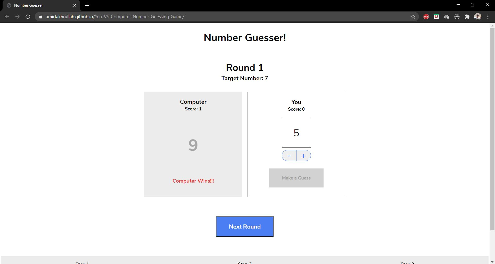

# You vs Computer in Number Guessing Challenge

## Description

A game between you and the computer, whoever selects the number closer to the target number wins. This game can be play for many rounds and each round, the winner gains 1 point.

## Table of Contents

* [Description](#description)
* [Technologies](#technologies)

## Technologies

### Programming Languages

* Javascript
* HTML
* CSS

### Deployment

* GitHub Pages

### Other technologies

* VSCode
* Git
* GitHub
